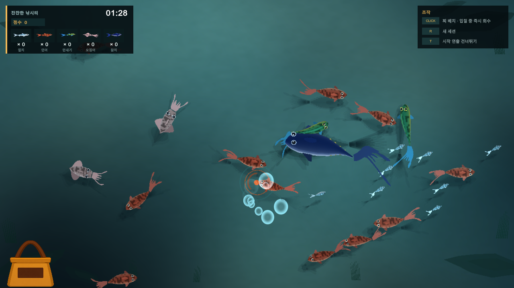

# Fishing Is Good

물고기를 지켜보다가 찌를 놓을 위치를 고르는 탑다운 낚시 프로토타입입니다. **Unity / Three.js**로 만들었습니다.

방치형 게임인 만큼 물고기가 움직이는 모습 자체에 보는 재미가 있기를 바랐습니다. 직접 조작할 때는 작은 위험과 보상을 주되, 계속 화면을 눌러야 하는 게임으로 만들고 싶지는 않았습니다.

행동 구현부터 물고기 메시 생성, 움직임 셰이더, 물 표현과 카메라 연출까지 AI와 함께 제작했습니다. 실행한 모습을 보고 원하는 느낌과 다른 부분을 전달하고, 수정된 결과를 다시 확인하며 짧게 반복했습니다.

물고기의 행동과 형태는 HTML에서 버전별로 다듬고 Unity로 옮겼습니다. 수면의 굴절과 빛, 물방울, 수중으로 들어가는 연출은 Unity에서 직접 작업했습니다. 이 저장소에서 두 결과물을 모두 실행해 볼 수 있습니다.

## 플레이 / 다운로드

| | 링크 |
|---|---|
| 브라우저에서 실행 | [HTML Prototype](https://chungheonlee0325.github.io/FishingIsGood/HTML/) |
| HTML 파일 다운로드 | [HTML ZIP](https://github.com/chungheonLee0325/FishingIsGood/releases/download/v0.1.2/FishingIsGood-HTML.zip) |
| Windows x64 실행 파일 | [Windows ZIP](https://github.com/chungheonLee0325/FishingIsGood/releases/download/v0.1.2/FishingIsGood-Windows-x64.zip) |
| 릴리스 / 파일 검증값 | [v0.1.2](https://github.com/chungheonLee0325/FishingIsGood/releases/tag/v0.1.2) |

수면을 클릭하면 찌를 놓습니다. 물고기가 물면 잠시 뒤 자동으로 회수하며, 그 전에 클릭하면 바로 회수할 수 있습니다. Windows 빌드는 ZIP 전체를 풀고 `FishingIsGood.exe`를 실행하면 됩니다.

Windows 빌드에서도 `R`로 세션을 다시 시작하고 `T`로 시작 연출을 건너뛸 수 있습니다. 물 프로파일을 강제로 바꾸는 `1~4`는 Editor 또는 Development Build에서만 동작하는 비교용 단축키입니다.



*Windows 빌드의 월드 렌더링 캡처. 검증 도구로 찌를 배치한 장면입니다.*

## 제작 범위

| 작업 | 구현과 반복 확인 |
|---|---|
| 물고기 행동·먹이 반응 | HTML 버전을 실행하며 찌 배치, 접근, 경쟁, 회수 흐름을 조정하고 Unity에 반영 |
| 물고기 에셋·움직임 | 어종별 파라미터로 메시와 색을 생성하고, 정점 셰이더로 몸의 굽힘·지느러미·오징어 다리를 표현 |
| 수면·수중 표현과 연출 | Unity에서 수면 합성, 굴절과 그림자, 착수 파문, 렌즈 물방울, 기포와 카메라 전환을 제작 |

물고기 에셋도 AI와 작성한 생성 코드로 만들었습니다. Unity의 메시 생성기와 어종 데이터를 통해 형태를 조절하고, 움직임은 실행 화면에서 확인했습니다.

## 만들면서 고친 것들

### 찌를 옮기면 물고기가 너무 많이 도망갔다

초기 버전에서는 찌를 옮길 때 주변 물고기가 크게 흩어졌습니다. 관찰하다가 한 번씩 개입하는 게임을 원했는데, 그 개입에 돌아오는 반응이 도피에 치우쳐 있었습니다.

찌 배치가 주요 조작이 되도록 도피 반응을 줄였습니다. 가까운 개체는 물러나더라도 주변에서는 관심을 보일 수 있게 반응을 나눴습니다. 자동 회수도 기본으로 두었습니다. 물고기를 지켜보다가 어디에 찌를 놓을지 고르고, 원하면 회수를 앞당기는 흐름입니다.

Unity에서는 이 반응을 도피와 유인으로 나눠 처리합니다. 어종별 유인 확률과 반복 착수에 대한 피로도도 따로 조절할 수 있습니다.

### 물고기의 흔들림과 선회를 나눠서 고쳤다

물고기끼리 비키도록 회피를 넣은 뒤에는 선회가 드드득 떨리는 문제가 생겼습니다. 몸이 좌우로 까닥거리는 현상도 있어서, 처음에는 두 증상을 구분해서 설명하기 어려웠습니다.

AI에게 움직임이 어색하다는 피드백을 주고 구현을 바꿔 가며 살펴봤습니다. 까닥거림은 몸을 굽히는 축과 관련이 있었고, 회피의 떨림은 위치 변화가 머리 방향 계산에 영향을 주면서 생겼습니다.

기존 회피는 물고기가 비켰다가 다시 돌아오는 움직임을 반복할 수 있었습니다. 회피 목표와 실제 위치에 더할 오프셋을 나누고, 두 단계에 걸쳐 부드럽게 따라가도록 바꿨습니다. 지금 HTML의 **좌우 재중심**과 **물고기끼리 회피** 옵션으로 각각의 영향을 살펴볼 수 있습니다.

머리가 이동 방향을 느리게 따라가도록 한 수정에서는 옆으로 미끄러지는 문제가 생겼습니다. 방향 차이에 상한을 두고 사행 경로의 주기도 늘려 조정했습니다. 이 차이는 HTML 상단의 **머리 감쇠 → 슬립 상한 → 사행 주기 2배** 프리셋에서 볼 수 있습니다.

### 물방울의 모양뿐 아니라 생기고 사라지는 시간도 다듬었다

물 표현은 Unity 화면에서 빛과 굴절, 카메라 움직임을 함께 보며 작업했습니다. 렌즈에 맺히는 물방울도 크기를 키우는 것에서 시작해 배치, 모양, 등장 속도와 흘러내리는 움직임을 차례로 수정했습니다.

처음에는 배치가 규칙적이었고, 물방울이 갑자기 생기거나 함께 사라져 기계적으로 보였습니다. AI에게 화면 전반에 흩어져 맺히고 아래로 흐르도록 피드백했습니다. 등장 시점을 나눠도 종료 시점이 다시 같아지는 문제가 남아, 물방울마다 수명과 맺히는 속도, 흘러내리기 시작하는 시간을 따로 두었습니다.

최종 구현에서는 물방울의 위치·크기와 시간표를 각각 조절합니다. 같은 효과를 여러 개 찍는 느낌을 줄이기 위해 모양과 시간의 차이를 함께 다뤘습니다.

### 착수 파문을 주변 물결과 같은 조명으로 표현했다

찌가 들어간 뒤 퍼지는 파문은 초기 구현에서 밝은 고리가 바깥으로 이동하는 모습이었습니다. 원했던 것은 수면이 굴곡지며 퍼지는 물결이었습니다.

파문의 높이와 기울기를 구하고, 주변 잔물결과 같은 조명 계산에 연결하도록 바꿨습니다. 물결의 한쪽은 빛을 받고 반대쪽은 어두워지며, 바깥으로 퍼질수록 파장이 넓어지고 세기가 줄어들게 했습니다. 착수 효과가 수면과 어울리는지를 Unity에서 다시 보며 조정했습니다.

## Unity에서 연결한 것들

HTML에서 다듬던 이동과 먹이 반응을 Unity에서도 이어서 구현했습니다. 물고기의 상태와 어종 데이터를 나누고, 찌의 입질·회수와 물고기가 낚시 가방으로 날아가는 흐름을 연결했습니다. Unity에서 제작한 물 표현과 카메라 연출은 이 플레이 흐름에 맞춰 동작합니다.

| 살펴볼 부분 | 소스 |
|---|---|
| 이동, 무리, 회피, 먹이 경쟁 | [FishAgentV2.cs](UnityProject/Assets/FishingV2/Scripts/Runtime/FishAgentV2.cs) |
| 찌 배치, 어획 집계, 리스폰 | [FishingV2Session.cs](UnityProject/Assets/FishingV2/Scripts/Runtime/FishingV2Session.cs) |
| 어종별 행동 데이터 | [FishingV2Types.cs](UnityProject/Assets/FishingV2/Scripts/Core/FishingV2Types.cs) |
| 낚시 가방까지의 회수 비행 | [CatchFlightV2.cs](UnityProject/Assets/FishingV2/Scripts/Runtime/CatchFlightV2.cs) |
| 어종별 메시 생성 | [FishMeshBuilderV2.cs](UnityProject/Assets/FishingV2/Scripts/Core/FishMeshBuilderV2.cs) |
| 수면 광학, 파문, 렌즈 물방울 | [WaterSurfaceV2.shader](UnityProject/Assets/FishingV2/Shaders/WaterSurfaceV2.shader) |
| 수면 진입과 프로파일 전환 | [FishingV2WaterPresentationDirector.cs](UnityProject/Assets/FishingV2/Scripts/Runtime/FishingV2WaterPresentationDirector.cs) |

어획은 물고기를 채는 순간이 아니라 낚시 가방에 도착할 때 집계합니다. 이 과정에서 도착 횟수와 집계가 맞는지, 잡힌 물고기가 한 마리씩 다시 생성되는지, 상태가 바뀔 때 위치가 크게 튀지 않는지를 별도로 확인했습니다.

기본 플레이 어종은 멸치·연어·만새기·오징어·참치 5종입니다. 추가 어종은 동작 검증에 사용합니다. AI는 개발 과정에 사용했으며, 게임 안의 물고기 행동은 규칙 기반으로 동작합니다.

<details>
<summary>Unity 검증 결과와 조건</summary>

2026-09-05, Unity **6000.3.23f1**에서 실행한 결과입니다. 기본 어획과 After-Bite 방생 경로를 나눠 검사했습니다.

| 항목 | 기본 Catch | After-Bite 방생 |
|---|---:|---:|
| Error / Exception / Assert | 0 | 0 |
| 큰 위치 점프 (>0.75 world units) | 0 | 0 |
| Catch 도착 / 집계 | 18 / 18 | 9 / 9 |
| 리스폰 실행 / 예약 | 18 / 18 | 9 / 9 |

seed `20260901`, `5,400 step × 1/60초`로 90초를 진행했습니다. 검증용 어종을 포함하며, 저장을 피하기 위해 검증 세션의 제한 시간은 600초로 설정했습니다. 일반 플레이에는 프레임 dt를 사용합니다.

검사 대상은 상태 전이, 어획 도착·집계, 리스폰과 이동의 연속성입니다. 별도로 실행한 Windows 빌드의 카메라 렌더·어획 결과는 [실행 기록](Media/unity-evidence.txt)에 있습니다.

</details>

## 직접 열어보기

HTML은 위 실행 링크 또는 내려받은 `index.html`로 열 수 있습니다. 현재 페이지에는 움직임과 먹이 반응을 켜고 끄는 옵션, 개선안을 비교하는 프리셋이 있습니다. 상단 프리셋부터 선택해 보세요. 먹이 경쟁 옵션은 Bite Commitment가 켜져 있고 여러 개체가 찌에 접근할 때 확인하기 좋습니다.

Unity 소스는 Unity Hub에서 **`UnityProject/`**를 Unity **6000.3.23f1**로 열고, [FishingV2Prototype Scene](UnityProject/Assets/FishingV2/Scenes/FishingV2Prototype.unity)을 실행하면 됩니다. `R`로 세션을 다시 시작하고 `T`로 시작 연출을 건너뛸 수 있습니다. 물 프로파일을 강제로 바꾸는 `1~4`는 Editor 또는 Development Build에서만 동작합니다.

<details>
<summary>자동 검증과 Windows 빌드 명령</summary>

Windows Build Support가 설치되어 있어야 합니다. 저장소 루트에서 실행하며, Editor 경로는 설치 위치에 맞춥니다. 결과물은 `Builds/Windows/`에 생성됩니다.

```powershell
$unityEditor = 'D:/Unity/6000.3.23f1/Editor/Unity.exe'

& $unityEditor `
  -batchmode `
  -projectPath "$PWD/UnityProject" `
  -executeMethod Fishing.V2.EditorTools.FishingPublicBuild.ValidateAndBuildWindows `
  -logFile "$PWD/public-build.log"
```

</details>

HTML 움직임 비교와 HTML → Unity 비교 영상은 촬영 후 추가할 예정입니다.

## 공개 범위

HTML 프로토타입과 Unity 프로젝트, 실행 빌드와 선별한 화면 자료를 함께 제공합니다.

프로젝트 자체의 오픈소스 라이선스는 아직 지정하지 않았습니다. HTML에 포함된 Three.js r128의 MIT 고지는 [별도 파일](ThirdParty/three.js-LICENSE.txt)에 보존했습니다. HTML의 글꼴은 Google Fonts에서 불러옵니다.

## 관련 프로젝트

- [Dororong World — AI 음성 명령 게임](https://github.com/chungheonLee0325/VoiceCommand): 음성을 AI 서버에 전달하고, 분석된 명령을 Unreal 게임 안의 대상과 행동으로 연결한 프로젝트입니다.
- [Project Gallery](https://github.com/chungheonLee0325)
