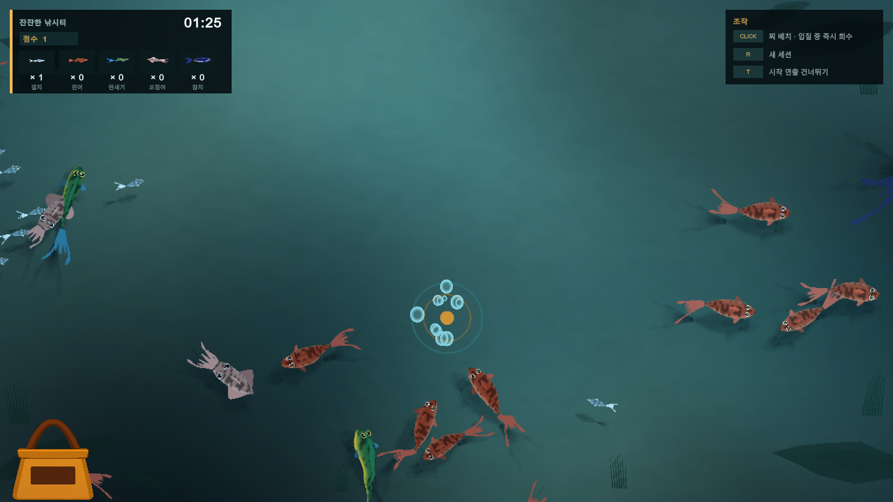
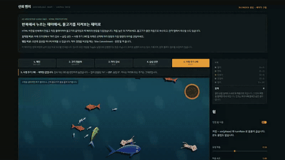
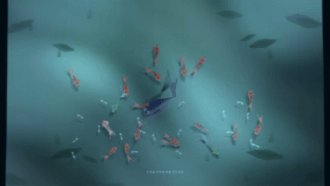
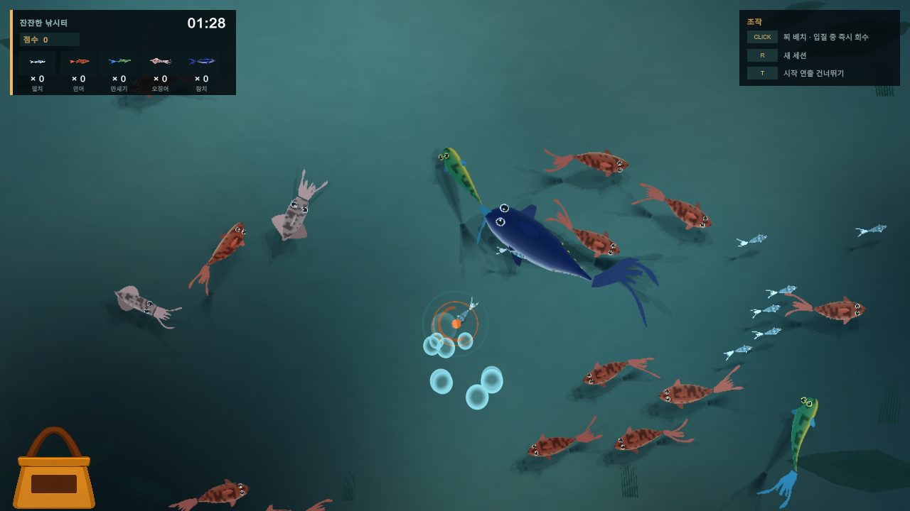
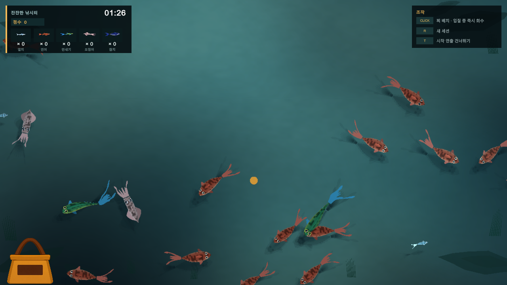

# Fishing Is Good

물고기를 지켜보다가 찌를 놓을 위치를 고르는 탑다운 낚시 프로토타입입니다. **Unity / Three.js**로 만들었습니다.

전통적인 낚시 게임의 타이밍 입력이나 반복 조작보다, 방치형 게임에 맞게 **물고기의 움직임을 지켜보는 것 자체가 재미가 되는 플레이**를 목표로 했습니다. 플레이어의 조작은 찌 배치와 선택적인 즉시 회수 정도로 줄였습니다.

물고기의 움직임과 반응이 핵심 플레이인 만큼, 실제 동작을 빠르게 반복해서 확인할 필요가 있었습니다. HTML 프로토타입에서 이동, 선회, 회피, 먹이 반응과 찌 배치에 따른 반응을 여러 버전으로 비교하고, 직접 플레이하며 남길 규칙을 정했습니다.

선택한 규칙은 Unity에서 상태와 어종별 데이터로 다시 구성하고, 입질·회수·집계까지의 게임플레이와 수면·수중 연출로 확장했습니다. AI는 구현 대안과 반복 작업을 빠르게 만드는 도구로 활용하고, 최종 판단은 실제 실행 결과를 기준으로 했습니다.

## 플레이 / 다운로드

| | 링크 |
|---|---|
| 브라우저에서 실행 | [HTML Prototype](https://chungheonlee0325.github.io/FishingIsGood/HTML/) |
| HTML 파일 다운로드 | [HTML ZIP](https://github.com/chungheonLee0325/FishingIsGood/releases/download/v0.1.3/FishingIsGood-HTML.zip) |
| Windows x64 실행 파일 | [Windows ZIP](https://github.com/chungheonLee0325/FishingIsGood/releases/download/v0.1.3/FishingIsGood-Windows-x64.zip) |
| 릴리스 / 파일 검증값 | [v0.1.3](https://github.com/chungheonLee0325/FishingIsGood/releases/tag/v0.1.3) |

수면을 클릭하면 찌를 놓습니다. 물고기가 물면 잠시 뒤 자동으로 회수하며, 그 전에 클릭하면 바로 회수할 수 있습니다. Windows 빌드는 ZIP 전체를 풀고 `FishingIsGood.exe`를 실행하면 됩니다.

Windows 빌드에서도 `R`로 세션을 다시 시작하고 `T`로 시작 연출을 건너뛸 수 있습니다.

## 영상

### Unity — 찌 배치부터 어획·수집까지

https://github.com/user-attachments/assets/206fbf14-7e2c-4b25-a181-e257144a7886

### HTML — 움직임 프리셋 비교와 찌 배치

https://github.com/user-attachments/assets/f5f60c8c-f10d-4c5c-a6c3-0bddb1c82563

<details>
<summary>물고기가 가방에 도착한 뒤 수량 표시</summary>



물고기가 낚시 가방에 도착하면 해당 어종의 `× 수량`과 점수가 함께 올라갑니다.

</details>

## 주요 구현

HTML 프로토타입에서는 물고기의 움직임과 반응을 빠르게 바꿔가며 확인했고, 남기기로 한 규칙은 Unity에서 상태와 어종별 데이터로 다시 구성했습니다. 물고기 자체의 형태와 움직임, 입질부터 수집까지의 흐름, 수면과 수중 연출도 함께 구현했습니다.

### 물고기 행동과 빠른 프로토타이핑

HTML에서는 이동, 선회, 회피, 접근, 먹이 반응과 찌 배치에 따른 반응을 바로 바꿔가며 비교했습니다.  
특히 움직임처럼 수치만으로 판단하기 어려운 요소는 여러 버전을 실제로 실행해 보고 다음 수정 방향을 정했습니다.

[](https://chungheonlee0325.github.io/FishingIsGood/Media/videos.html#html)

*움직임 프리셋과 일부 행동 옵션을 바꾸며 차이를 비교하는 HTML 프로토타입.*

### Unity 게임플레이

HTML 코드를 그대로 옮기기보다, 남기기로 한 행동 규칙을 Unity의 상태와 어종별 데이터로 다시 구성했습니다.

물고기의 현재 행동은 `FishState`로 구분하고, 접근 방식은 `ApproachStyle`, 먹이 반응과 움직임·경쟁·입질 후 행동은 각각 `FeedSignature`, `MotionSignature`, `ContestSignature`, `AfterBiteProfile`로 분리했습니다.

찌 배치와 입질, 회수, 낚시 가방 도착과 리스폰은 `FishingV2Session`을 중심으로 연결하고, 물고기의 개별 행동은 `FishAgentV2`에서 처리합니다.

[](https://chungheonlee0325.github.io/FishingIsGood/Media/videos.html#unity)

*찌 배치부터 물고기의 접근, 입질, 회수와 수집까지 연결된 Unity 플레이.*

### 어종별 Procedural Mesh와 움직임

물고기는 별도 모델 파일에 의존하지 않고 어종별 형태 데이터를 이용해 메시를 생성합니다.

몸통의 길이·폭·높이 프로파일과 꼬리·지느러미·오징어 다리 등을 조합하고, 정점 셰이더를 통해 몸의 굽힘과 부위별 움직임을 표현했습니다. 같은 생성 구조를 사용하면서 어종별 실루엣과 움직임이 다르게 보이도록 조정했습니다.



관련 소스:
- [FishMeshBuilderV2.cs](UnityProject/Assets/FishingV2/Scripts/Core/FishMeshBuilderV2.cs)
- [FishingV2Types.cs](UnityProject/Assets/FishingV2/Scripts/Core/FishingV2Types.cs)

### 수면과 수중 연출

수면은 단순한 반투명 Plane보다 하나의 광학 레이어처럼 보이도록 구성했습니다.

수면 굴절과 그림자, 바닥의 빛 패턴, 착수 파문, 기포, 렌즈 물방울을 함께 처리하고, 시작 시 수면 위에서 수중으로 내려가는 카메라 연출을 연결했습니다.



관련 소스:
- [WaterSurfaceV2.shader](UnityProject/Assets/FishingV2/Shaders/WaterSurfaceV2.shader)
- [FishingV2WaterPresentationDirector.cs](UnityProject/Assets/FishingV2/Scripts/Runtime/FishingV2WaterPresentationDirector.cs)

---

## 개발 과정에서 해결한 문제

### 찌를 옮기면 물고기가 너무 많이 도망갔다

초기 버전에서는 찌를 옮길 때 주변 물고기가 크게 흩어졌습니다. 관찰하다가 한 번씩 개입하는 게임을 원했는데, 직접 조작했을 때 돌아오는 반응이 도피에 치우쳐 있었습니다.

찌 배치가 주요 조작이 되도록 가까운 개체의 도피와 주변 개체의 관심을 나눴습니다. 자동 회수도 기본으로 두어, 플레이어는 물고기를 지켜보다가 어디에 찌를 놓을지 고르고 필요할 때만 회수를 앞당길 수 있도록 했습니다.

Unity에서는 도피와 유인을 별도로 처리하고, 어종별 유인 확률과 반복 착수에 대한 피로도를 조절할 수 있게 구성했습니다.

<!-- 촬영 후 추가 권장

#### Before / After

| Before — 착수 후 주변 물고기가 크게 흩어짐 | After — 가까운 도피와 주변 관심을 분리 |
|---|---|
|  |  |

권장 길이: 각 4~6초
같은 화면 범위에서 찌를 비슷한 위치에 놓고 주변 개체의 첫 반응이 보이도록 촬영.
-->

### 물고기의 흔들림과 선회를 나눠서 고쳤다

물고기끼리 비키도록 회피를 추가한 뒤 선회가 드드득 떨리는 문제가 생겼습니다. 동시에 몸이 좌우로 까닥거리는 현상도 있어 처음에는 같은 문제처럼 보였습니다.

실행 화면을 반복해서 확인한 결과, 몸의 까닥거림과 회피 중 선회 떨림의 원인이 달랐습니다.

회피에서는 물고기가 비켰다가 감지 범위를 벗어나면 다시 돌아오는 과정이 반복되면서 위치 변화가 머리 방향에도 영향을 주고 있었습니다. 회피 목표와 실제 위치에 더할 오프셋을 분리하고, 두 단계에 걸쳐 목표를 따라가도록 변경했습니다.

머리 방향을 강하게 감쇠했을 때는 흔들림이 줄어드는 대신 실제 이동 방향과 머리 방향이 벌어져 옆으로 미끄러지는 것처럼 보였습니다. 방향 차이에 상한을 두고 사행 경로의 주기를 조정해 해결했습니다.

현재 HTML에서는 **좌우 재중심**, **물고기끼리 회피**, **머리 감쇠 → 슬립 상한 → 사행 주기 2배** 프리셋으로 차이를 확인할 수 있습니다.

[](https://chungheonlee0325.github.io/FishingIsGood/Media/videos.html#html)

<!-- 별도 Before / After GIF를 만들면 위 GIF 대신 아래 구성이 더 좋음.

#### Before / After

| Before — 회피 중 방향이 반복해서 흔들림 | After — 회피 목표와 실제 오프셋을 분리 |
|---|---|
|  |  |

이 사례는 README에서 가장 중요한 Before / After 자료이므로 우선 제작 권장.
-->

### 물방울의 모양과 시간 흐름을 함께 조정했다

렌즈 물방울은 크기와 배치만 바꾸는 것으로는 자연스럽게 보이지 않았습니다. 여러 물방울이 비슷한 시점에 나타나고 사라지면서 같은 효과를 복제한 것처럼 보였습니다.

물방울마다 수명과 맺히는 속도, 흘러내리기 시작하는 시점을 나누고 위치와 크기에도 차이를 두었습니다. 형태뿐 아니라 시간 흐름까지 개별적으로 조절해 화면 전체에 흩어져 맺히고 사라지는 느낌을 만들었습니다.

<!-- 스크린샷 또는 짧은 GIF 권장

#### Before / After

| Before — 비슷한 시점에 생성·소멸 | After — 개별 수명과 흐름 적용 |
|---|---|
|  |  |

사진만 사용해도 충분한 사례.
영상으로 만들 경우 3~5초 정도만 사용.
-->

### 착수 파문을 주변 물결과 같은 조명으로 표현했다

초기 착수 효과는 밝은 고리가 바깥으로 이동하는 형태였습니다. 기능적으로는 파문으로 읽혔지만 주변 수면과 별개의 이펙트처럼 보였습니다.

파문의 높이와 기울기를 구하고 기존 수면과 같은 조명 계산에 연결했습니다. 물결의 한쪽은 빛을 받고 반대쪽은 어두워지며, 바깥으로 갈수록 파장이 넓어지고 세기가 줄어들도록 수정했습니다.

수면의 굴절과 잔물결에는 절대 시간에 속도를 곱하는 대신 누적 위상을 사용했습니다. 연출 도중 수면 속도를 변경해도 위상이 한 번에 건너뛰지 않아 기존 흐름을 유지한 채 속도만 바뀝니다.

<!-- 이 사례는 이미지 또는 짧은 GIF Before / After를 강력 추천

#### Before / After

| Before — 밝은 링이 이동하는 형태 | After — 수면 기울기와 조명을 이용한 파문 |
|---|---|
|  |  |

움직임 차이가 중요하므로 PNG보다 3~5초 GIF 권장.
-->

## Unity Runtime 구조

HTML 코드를 그대로 옮기기보다, 플레이하면서 남기기로 한 행동 규칙을 Unity의 상태와 어종별 데이터로 다시 구성했습니다.

물고기의 현재 행동은 `FishState`로 구분하고, 접근 방식은 `ApproachStyle`, 먹이 반응과 움직임·경쟁·입질 후 행동은 각각 `FeedSignature`, `MotionSignature`, `ContestSignature`, `AfterBiteProfile`로 분리했습니다. 같은 상태 흐름을 사용하면서도 어종마다 움직이는 박자와 먹이에 반응하는 방식이 달라지도록 구성했습니다.

찌 배치와 입질, 회수, 낚시 가방 도착과 리스폰은 `FishingV2Session`을 중심으로 연결하고, 물고기의 개별 행동은 `FishAgentV2`에서 처리합니다. Unity에서 제작한 물 표현과 카메라 연출도 이 플레이 흐름에 맞춰 동작합니다.

| 살펴볼 부분 | 소스 |
|---|---|
| 이동, 무리, 회피, 먹이 경쟁 | [FishAgentV2.cs](UnityProject/Assets/FishingV2/Scripts/Runtime/FishAgentV2.cs) |
| 찌 배치, 어획 집계, 리스폰 | [FishingV2Session.cs](UnityProject/Assets/FishingV2/Scripts/Runtime/FishingV2Session.cs) |
| 상태·접근 방식·어종별 행동 데이터 | [FishingV2Types.cs](UnityProject/Assets/FishingV2/Scripts/Core/FishingV2Types.cs) |
| 낚시 가방까지의 회수 비행 | [CatchFlightV2.cs](UnityProject/Assets/FishingV2/Scripts/Runtime/CatchFlightV2.cs) |
| 어종별 메시 생성 | [FishMeshBuilderV2.cs](UnityProject/Assets/FishingV2/Scripts/Core/FishMeshBuilderV2.cs) |
| 수면 광학, 파문, 렌즈 물방울 | [WaterSurfaceV2.shader](UnityProject/Assets/FishingV2/Shaders/WaterSurfaceV2.shader) |
| 수면 진입과 프로파일 전환 | [FishingV2WaterPresentationDirector.cs](UnityProject/Assets/FishingV2/Scripts/Runtime/FishingV2WaterPresentationDirector.cs) |

어획은 물고기를 채는 순간이 아니라 낚시 가방에 도착할 때 집계합니다. 이 과정에서 도착 횟수와 집계가 맞는지, 잡힌 물고기가 한 마리씩 다시 생성되는지, 상태가 바뀔 때 위치가 크게 튀지 않는지를 별도로 확인했습니다.

기본 플레이 어종은 멸치·연어·만새기·오징어·참치 5종입니다. 추가 어종은 동작 검증에 사용합니다. AI는 개발 과정에 사용했으며, 게임 안의 물고기 행동은 규칙 기반으로 동작합니다.

<details>
<summary>Runtime 검증</summary>

2026-09-05, Unity **6000.3.23f1**에서 실행한 결과입니다. 기본 어획과 After-Bite 방생 경로를 나눠 검사했습니다.

| 항목 | 기본 Catch | After-Bite 방생 |
|---|---:|---:|
| Error / Exception / Assert | 0 | 0 |
| 큰 위치 점프 (>0.75 world units) | 0 | 0 |
| Catch 도착 / 집계 | 18 / 18 | 9 / 9 |
| 리스폰 실행 / 예약 | 18 / 18 | 9 / 9 |

seed `20260901`, `5,400 step × 1/60초`로 90초를 진행했습니다. 검증용 어종을 포함하며, 저장을 피하기 위해 검증 세션의 제한 시간은 600초로 설정했습니다. 일반 플레이에는 프레임 dt를 사용합니다.

검사 대상은 상태 전이, 어획 도착·집계, 리스폰과 이동의 연속성입니다. 별도로 실행한 Windows 빌드의 카메라 렌더·어획 결과는 [실행 기록](Media/unity-evidence.txt)에 있습니다.

</details>

## 실행 방법

HTML은 위 실행 링크 또는 내려받은 `index.html`로 열 수 있습니다. 현재 페이지에는 움직임과 먹이 반응을 켜고 끄는 옵션, 개선안을 비교하는 프리셋이 있습니다. 상단 프리셋부터 선택해 보세요. 먹이 경쟁 옵션은 Bite Commitment가 켜져 있고 여러 개체가 찌에 접근할 때 확인하기 좋습니다.

Unity 소스는 Unity Hub에서 **`UnityProject/`**를 Unity **6000.3.23f1**로 열고, [FishingV2Prototype Scene](UnityProject/Assets/FishingV2/Scenes/FishingV2Prototype.unity)을 실행하면 됩니다. `R`로 세션을 다시 시작하고 `T`로 시작 연출을 건너뛸 수 있습니다. 물 프로파일을 강제로 바꾸는 `1~4`는 Editor 또는 Development Build에서만 동작합니다.

<details>
<summary>자동 검증과 Windows 빌드 명령</summary>

Windows Build Support가 설치되어 있어야 합니다. 저장소 루트에서 실행하며, Editor 경로는 설치 위치에 맞춥니다. 결과물은 `Builds/Windows/`에 생성됩니다.

```powershell
$unityEditor = 'D:/Unity/6000.3.23f1/Editor/Unity.exe'

& $unityEditor `
  -batchmode `
  -projectPath "$PWD/UnityProject" `
  -executeMethod Fishing.V2.EditorTools.FishingPublicBuild.ValidateAndBuildWindows `
  -logFile "$PWD/public-build.log"
```

</details>

## 라이선스 및 참고

프로젝트 자체의 별도 오픈소스 라이선스는 지정하지 않았습니다. HTML에 포함된 Three.js r128의 MIT 고지는 [별도 파일](ThirdParty/three.js-LICENSE.txt)에 보존했습니다. HTML의 글꼴은 Google Fonts에서 불러옵니다.

## 관련 프로젝트

- [Dororong World — AI 음성 명령 게임](https://github.com/chungheonLee0325/VoiceCommand): 음성을 AI 서버에 전달하고, 분석된 명령을 Unreal 게임 안의 대상과 행동으로 연결한 프로젝트입니다.
- [Project Gallery](https://github.com/chungheonLee0325)
